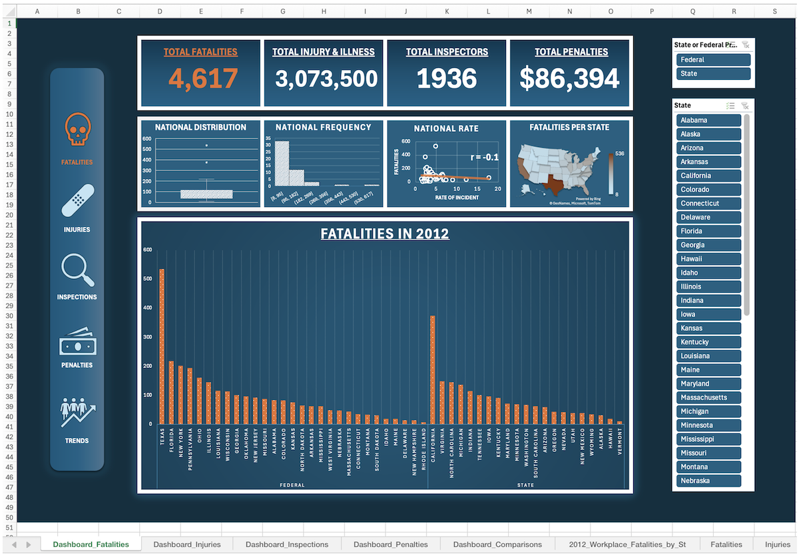

# Workplace Fatalities Analysis (Excel)
Excel-based data analysis project exploring U.S. workplace fatalities (2012). Includes data cleaning, interactive dashboards, and an analytical report highlighting trends, insights, and storytelling through visualization. Part of QuickStart Data Analytics Bootcamp.

## Overview
This project explores workplace fatalities, injuries, inspections, and penalties across U.S. states in 2012. Using Excel, I performed exploratory data analysis (EDA), cleaned and transformed the dataset, and built an interactive dashboard with pivot tables, slicers, and visualizations.  

The goal was to uncover meaningful insights and enable users to interactively explore the data through descriptive statistics, charts, and dashboards.

---

## Tools & Techniques
- **Excel:** Pivot tables, slicers, data cleaning, formulas, and dashboard design  
- **Exploratory Data Analysis (EDA):** Descriptive statistics, distribution plots  
- **Analytics Storytelling:** Data narratives supported by visuals  

---

## Key Questions Explored
1. Which program, state or federal, has the highest rate of fatalities?  
2. Which state with a state program has the highest number of injuries/illnesses?  
3. What is the relationship between “Average of Years to Inspect Each Workplace Once” and “Rate of Fatalities”?  

---

## Process
1. **Data Cleaning & Transformation**  
   - Standardized column formats and handled missing values  
   - Created calculated fields for rates and comparisons  

2. **Exploratory Analysis**  
   - Generated descriptive statistics  
   - Built visualizations including box plots, histograms, and scatter plots  

3. **Dashboard Development**  
   - Designed an interactive Excel dashboard with slicers for dynamic filtering  
   - Integrated multiple pivot tables for exploring data by state, program type, and outcome  

4. **Storytelling & Insights**  
   - Highlighted the disparity between state vs. federal program fatality rates  
   - Identified the state program with the highest injury/illness count  
   - Analyzed correlations between inspection cycles and fatality rates  

---

## Key Insights
- Federal programs exhibited **higher fatality rates** compared to state programs.  
- Among state programs, **California** had the highest reported injuries and illnesses.  
- Longer inspection cycles were associated with **higher fatality rates**, suggesting that inspection frequency may impact workplace safety.

---

## Deliverables
- **Excel Report:** Cleaned dataset, pivot tables, and dashboard  
- **Written Report:** Summarized methodology, insights, Excel features used, and recommendations for improvement  

---

## Future Improvements
1. Expand dataset to include multiple years for trend analysis.  
2. Add geographic heatmaps for fatalities and injuries by state.  
3. Automate reporting with Power Query or Power BI for scalability.  

---
## Dashboard Screenshot

